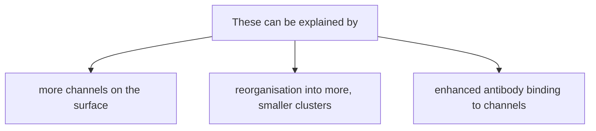

[Link to paper:](https://pubs.acs.org/doi/10.1021/acs.nanolett.1c00599)

>[!Question] The main question that this paper asks is whether Piezo1 localisation is governed by tension gradients or long-scale mechanical perturbations.

To answer this, the nanoscale localisation of Piezo1 on RBCs was probed at high resolutions ~30nm, and the abundance of Piezo1 clusters was studied during interaction with Yoda1. Further, it was shown that Piezo1 channels interact with the spectrin cytoskeletton in both resting and activated states.

There have been multiple, conflicting pieces of evidence regarding the role of membrane tension, curvature and cytoskeleton in the distribution of Piezo1 in the cell membrane.

>[!Example] There have been multiple, conflicting pieces of evidence regarding the role of membrane tension, curvature and cytoskeleton in the distribution of Piezo1 in the cell membrane.
>1. Piezo1 is sensitive to lateral membrane tension and can sense forces transmitted directly through the membrane (force-from-lipids model).
>2. While cytoskeleton involvement has been disproved in many cases, Piezo1 can sense and respond to localised or long-range mechanical perturbations.
>3. It is unclear why Piezo1  is recruited to cell-junction or focal adhesion sites - does it form domains that facilitate recruitment?

---
### Results

A polyclonal Piezo1 antibody that binds to the extracellular domain of Piezo1 was used to evaluate its distribution using force-volume (FV) and force-distance (FD) - AFM. 
In order to prove the specific attachment of the antibody-coated AFM tip to Piezo1 channels on the RBC membrane, a simplified model surface was used.

1. Probing RBC ghosts with the antibody resulted in clean bands on Western blots (*no cross reaction*).
2. **Force-volume (FV) and force-distance (FD) AFM** were used to measure binding between a PIEZO1-antibody on the AFM tip and PIEZO1 protein fragments immobilized on a flat gold surface.
		The AFM tip was modified by attaching a PEG linker (that captures a single antibody molecule) so that the antibody could orient freely. Adhesion events that occur at distances >10 nm upon retraction can be confidently attributed to the stretching of this linker–antibody complex, i.e., **specific interactions**.

**Force-volume microscopy** was used - and the cantilever deflection was recorded to produce a Force-Distance (FD) curve. Only ~6% of all retraction curves displayed specific adhesion. This low binding probability is consistent with single‑molecule detection; too high a density of active molecules on either the tip or surface would yield multiple simultaneous interactions and a much higher hit rate.

Control experiments were performed to establish the specificity of the interactions:
1. Injecting free Piezo1 antibody in the fluid cell reduced binding sites and the binding frequency of the curve fell to <2%.
2. A new AFM tip was functionalised with an isotype control antibody (same IgG and sp. but different antigen) and used - and the binding frequency fell much lower as well.

RBCs have a featureless membrane surface with different curvatures and tensions, expressing Piezo1 in their native state. In order to preserve biconcave architecture and prevent detachment during AFM, RBCs were fixed and mounted on poly-L-lysine plates.

**FD‑AFM (Force – Distance curve based AFM)** is an imaging mode where a full force-distance curve is recorded at each pixel of the scan, rather than just a topographical height signal.
As the tip approaches, contacts, and retracts from the surface, the cantilever deflection is recorded as a function of time (and thus distance). This produces a force–time (FT) curve for every pixel.

Each FT curve is inspected for the presence of adhesion events - only specific adhesion events are included in analysis.

Comparing:

| **Parameter**     | **Model surface (artifical fragments)** | **Native RBC surface**     |
| ----------------- | --------------------------------------- | -------------------------- |
| Binding frequency | ~6%                                     | ~2%                        |
| Rupture force     | 71 ± 21 pN at 1 µm s⁻¹                  | 115 ± 26 pN at ~125 µm s⁻¹ |

On RBCs, PIEZO1 is expressed at endogenous levels and is sparsely distributed in the membrane, so the probability of the antibody‑tip landing exactly on a channel is lower.
In single‑molecule force spectroscopy, the measured unbinding force depends logarithmically on the **loading rate** (the rate at which force is applied to the bond). The retraction speed on RBCs (~125 µm s⁻¹) is 125‑fold faster than that used on the model surface (1 µm s⁻¹). The increased loading rate shifts the most probable rupture force to a higher value, as bonds have less time to thermally escape the binding well before the critical force is reached.

The rupture forces measured on the model surface (71 pN at 1 µm s⁻¹) and on RBCs (115 pN at ~125 µm s⁻¹) are quite different. Are these two populations genuinely arising from the same PIEZO1–antibody bond, or are they probing different interactions? To answer this, the authors perform **dynamic force spectroscopy (DFS)** and analyse the data within the framework of the **Bell–Evans model**. This unifies the measurements and extracts the intrinsic kinetic parameters of the bond.

>[!Question] Why does the rupture force dependent on pulling speed?

Applying an external pulling force F adds a mechanical potential that **tilts** the free‑energy landscape, effectively lowering the activation barrier for unbinding.
The barrier is lowered by an amount $F \cdot x_u$​, where xu​ is the **distance from the bound state to the transition state** (the width of the energy well along the pulling coordinate).
The rupture forces and LRs from FT curves recorded on both model surfaces and RBCs, and the extracted rupture forces show a linear dependency with the logarithm of the LR. 

--- 
>[!Check] Yoda1 increases Piezo1 accessibility to antibody in LC areas!

Yoda1 acts as a gating modifier that flattens Piezo1 blades and makes it more sensitive to mechanical force. Yoda1 allows Ca2+ influx - which is quantified by spectroflurimetry, allowing a readout of Piezo1 activation in live cells.

**An optimum concentration of Yoda1 is necessary for optimal activation without causing secondary effects.** At higher concentrations, Yoda1 increases Ca2+ influx, but caused 2$^\circ$ effects like 
- loss of transverse membrane asymmetry (which exposes PS, and prevents Piezo1 activation)
- loss of biconcavity in RBCs which could induce membrane curvature effects

Hence 50 nM Yoda1 was used - to keep the Ca2+ response linearly dependent on Yoda1 concentration.

It was observed that in resting RBCs, *Piezo1 appears in distinct clusters* which might implicate lipid rafts. After **Yoda1 treatment**, two changes were observed:
- Mean fluorescence intensity per RBC increased 1.7-fold.
- The number of Piezo1 clusters per cell increased significantly.

 These can be explained by:

^2fae73

The **AFM** results strongly favoured [enhanced antibody binding](#^2fae73) as a solution. Using the Piezo1-antibody-attached AFM tips, adhesion maps and topography on resting and Yoda1-treated RBCs were recorded. 
1. Binding frequency- the percentage of FD curves that display a specific adhesion event
2. Rupture force - the force at which the antibody-Piezo1 bond breaks

| Parameter         | Control RBCs | Yoda1‑treated RBCs      |
| ----------------- | ------------ | ----------------------- |
| Binding frequency | 1.8 ± 0.3%   | 3.5 ± 0.4% (≈2‑fold ↑)  |
| Rupture force     | 157 ± 36 pN  | 159 ± 21 pN (unchanged) |
Hence, binding frequency doubles in presence of Yoda1, while rupture force is unchanged. This means that Yoda1 triggers opening of the channels, which increases the fraction of channels with accessible epitopes to the antibody - thus increasing the probability of binding per approach.

---

>[!Check] Yoda1 increases the number of Piezo1 clusters in LC areas!

 
The RBCs were divided into three concentric regions - inner, median and outer. 

| Zone           | Curvature             | Tension | Resting PIEZO1 | +Yoda1 PIEZO1   |
| -------------- | --------------------- | ------- | -------------- | --------------- |
| Rim (outer)    | High (mild, µm scale) | Low     | High abundance | Slight increase |
| Dimple (inner) | Low                   | High    | Low abundance  | Large increase  |

Thus, Yoda1 seems to redistribute or unmask Piezo1 twoards the dimple - which is the low curvature, high tension zone.

It is suggested that:
Yoda1 could induce conformational changes that increase the affinity (or interaction probability?) toward the PIEZO1‑antibody and the intrinsic curvature of PIEZO1 upon activation favours a stronger interaction with LC areas.

It has also been observed that Piezo1-GFP diffusion is restricted by cholesterol-rich domains. Yoda1, by opening the channel, and possibly altering its lipid environment, could enhance Piezo1 motility towards the dimple.

---

>[!Check] Piezo1 integrates signals from the spectrin cytoskeleton!

To resolve the nanoscale relationship, FD‑AFM adhesion maps (showing single PIEZO1 antibody‑binding events) were compared with a model of the spectrin network. - When adhesion events (white dots) are overlaid on this lattice, many fall exactly on the **connection points (junctions)** of the lattice.

- Quantitatively, **~50% of all detected PIEZO1 channels lie within 20 nm of these junctional nodes** (the 20 nm threshold corresponds to the PEG–antibody complex size, i.e., the positional uncertainty of the AFM tip). This is far more than expected by chance, implying that PIEZO1 preferentially localises at or near spectrin junctional complexes.

if PIEZO1 follows the spectrin mesh, the distances between nearest neighbour channels should reflect the characteristic spacings of that lattice. The fact that the distances are identical in control and Yoda1 conditions confirms that the underlying spatial template is static and not reorganized by channel activation.

Thus,
- Yoda1 does not alter the cytoskeletal association; it only reveals channels in high‑tension areas by epitope unmasking.

- PIEZO1 thus integrates signals from both the lipid environment and the cytoskeleton, supporting a dual gating model.
