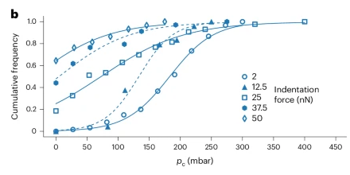
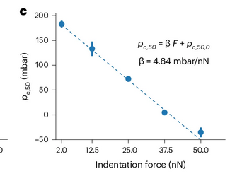

This paper introduces a new method for studying how membrane tension and Piezo1 activation are locally controlled by the cytoskeleton. Piezo1 has already been shown to directly sense membrane tension. A live cell membrane is mechanically inhomogenous, and hence membrane tension does not spread freely. 
In contrast to the old fluid mosaic model, the membrane proteins are often anchored to the actin cytoskeleton, forming pickets that act like fences - restricting the movement of lipids and other proteins. This divides the membrane into compartments - and hence mechanical perturbations are confined to these compartments.

**However, when the stimulus directly engages the actin cortex, long-range tension can be transmitted, since the cytoskeleton itself is a connected network.**

Since Piezo1 senses membrane tension, cytoskeletal picketing leads to localised Piezo1 activation - and this enables cells to steer or flow. Also, Piezo1's tendency to cluster amplifies the local signalling. 

>[!info] To ponder
>The apical and basal membranes of an adherent cell are effectively separate mechanical compartments, and Piezo1 distribution on each could be independently controlled by local tension.

Patch-clamp restricts knowledge of the local mechanical state because one cannot control how hard the pipette pushes into the cell versus how much suction is applied. Standard AFM allows the application of a controlled force, but not the imaging of local Ca2+ flux.

**FluidFM** is an AFM‑like technique where the cantilever has a hollow microfluidic channel. Instead of a solid tip, it uses a micropipette with a sub‑micrometre opening. This allows:

- **Indentation** with known force (pushing into the cell),
- **Aspiration** (sucking membrane into the pipette) with known pressure,
- **Simultaneously**, because the pipette is filled with fluid, ions and dyes are not displaced - calcium imaging can be performed right at the contact site.

**Flipper‑TR** is a lipid‑like dye that changes its fluorescence lifetime (the time it stays excited before emitting light) depending on membrane tension. It doesn’t measure intensity - it measures a physical parameter (lifetime) that is sensitive to lipid packing. By imaging Flipper‑TR lifetime, they can create **real‑time maps of membrane tension** across the cell surface. Combining this with FluidFM means they can locally apply force and **watch where the tension goes**.

---

>[!Check] FluidFM with Ca2+ imaging measures mechanosensitivty

The FluidFM nanopipette simultaneously:
- indents the cell surface with a known force (25 nN), which compresses the membrane and underlying cytoskeleton locally.
- aspirates a small patch of membrane into the tip with negative pressure (200 mbar), which stretches the lipid bilayer, increases local membrane tension.

When cells with a fluorescent calcium indicator (like Cal-520) were subjected to this treatment, there was a jump in the fluorescence, **first locally, then spreading across the entire cell**. This indicates that a large amount of extracellular Ca2+ has entered, consistent with the opening of Piezo1-like channels.

To ensure that the Ca2+ entry was through channels and not through the lipid bilayer, the integrity of the lipid bilayer was confirmed through SR101, a bright red dye that cannot cross the bilayer, and thus would not enter the cell. Since this happened, it was evident that Ca2+ entry was through channels, and not through leaks.

| Condition                                       | Responding cells | Interpretation                                                                                                                                                                                                                              |
| ----------------------------------------------- | ---------------- | ------------------------------------------------------------------------------------------------------------------------------------------------------------------------------------------------------------------------------------------- |
| **Control** (normal Ca²⁺ buffer)                | 70%              | Standard stimulus activates channels reliably.                                                                                                                                                                                              |
| **Ca²⁺‑free buffer** (EGTA in bath and pipette) | 3%               | Removing extracellular Ca²⁺ nearly abolishes the response. This rules out release from internal stores; the calcium must come from outside the cell, through plasma membrane channels.                                                      |
| **GsMTx4** (mechanosensitive channel blocker)   | 25%              | GsMTx4 inhibits mechanosensitive channels (Piezo1, TRP channels) by partitioning into the membrane and altering its mechanics. The response is strongly reduced but not eliminated, consistent with the known partial inhibition of GsMTx4. |
| **Yoda1** (Piezo1‑specific activator)           | 95%              | Yoda1, which lowers the mechanical threshold for Piezo1 opening, dramatically increases the response rate. This demonstrates that Piezo1 is the predominant channel gated by this stimulus.                                                 |

They now image the calcium rise at high speed. A representative result (Fig. 1g) shows:

- **The calcium increase starts exactly at the stimulation site** - the point where the pipette contacts the membrane.
- It then **spreads as a wave** across the cell with a velocity of **22.4 ± 4.8 µm s⁻¹**.

This speed matches the known diffusion rate of free Ca²⁺ in cytoplasm (10–50 µm s⁻¹, ref 35). So the spreading is passive diffusion after a point source, not an active regenerative wave (like in cardiac myocytes). It also confirms that Piezo1 is opened **locally**, where the mechanical stimulus is applied; the calcium then simply diffuses.

---

>[!Check] Flipper-TR imaging during FluidFM reveals tension changes

Piezo1 activation has been associated with membrane tension changes - whose extent and propagation needed to be confirmed on mechanical stimulation by FLuidFM. Flipper-TR inserted into the membrane changes its lifetime based on membrane tension, thus ensuring the tracking of spatial distribution over time, along with the information on tension propagation.

A FLIM system measures the **time delay** between each excitation laser pulse and the arrival of the emitted photon. By accumulating many photons, the fluorescence decay curve is reconstructed for each pixel. The decay is then fitted with an exponential model to extract the lifetime(s).

FLIM gives you a lifetime in **nanoseconds (ns)**, not a tension in **mN m⁻¹**. To convert, they performed a separate calibration:

- They used **optical tweezers** to pull a thin membrane tether from HFF‑1 cells.
- By measuring the force on the trapped bead and knowing the tether geometry, the membrane tension can be calculated (via the well‑known relationship $$F=2π2κTF=2π2κT​$$where FF is tether force, κκ is membrane bending rigidity, and T is tension).
- They varied membrane tension by applying **hyposmotic shock** (which swells cells and increases tension), and for each tension value they simultaneously recorded the Flipper‑TR lifetime.
- The data yielded a linear relationship: a **1 ns increase in lifetime** corresponds to an increase in membrane tension of **1.325 ± 0.392 mN m⁻¹**.

**Membrane tension is locally confined**, even under direct mechanical indentation. The basal membrane (near adhesions) and the apical membrane (facing medium) can therefore exist at **vastly different tensions**, and a force applied at one surface does not automatically equalise them.

It was found that both indentation (increase in force) and aspiration (applying negative pressure to suck in membrane patch) results in an overall lifetime increase in Flipper. However, these increases were local which showed that the membrane tension increase was restricted to the point of stimulation.

---

>[!Check] Combined stimuli affect the number of activated Piezo1 channels

The FluidFM force-controlled micropipette enables us to independently control local indentation force and aspiration pressure, and thereby to assess their cooperative effect on mechanosensitive ion channels via calcium imaging. 

Once the probe is brought into contact with the cell membrane at the controlled indentation force F, aspiration pressure pulses of increasing intensity were applied while monitoring the $Ca^{2+}$  response. Between pressure pulses, the aspiration was paused for 1s to ensure the equilibriation of Piezo1, and minimise the effect of channel inactivation. 

**The critical aspiration pressure $p_c$ was recorded for 60 cells with this procedure being repeated on each, and the activation probability for different F's were recorded.

This result suggests that Piezo1 response and/or membrane tension are affected not only by the geometrical stretch of membrane area but also by the presence of the underlying cytoskeleton.

The half-maximum critical aspiration pressure $p_{c,50}$ as a function of the indentation force F was recorded.

The linearly decreasing curve tells us a mechanism whereby colocalised indentation and aspiration stimuli add together to induce a critical total membrane tension, leading to the activation of Piezo1. To understand this cooperative effect, the average tension increase from the cooperative effects can be used to establish that **the total membrane tension change $\Delta T_{tot}$ leading to a Piezo1 response is not constant**.

If we assume that neither indentation nor aspiration change the sensitivity and conductivity of each Piezo1 channel, this result highlights that the cell-wide calcium response does not depend solely on the average membrane tension increase induced at the pipette. 

The observed cell-wide calcium response is elicited by **a number of Piezo1 channels**, and the likelihood of each channel being activated is dependent on the local membrane tension surrounding it. Because this tension distribution is not uniform - highest under the rim and decays outward - the number of channels that experience a suprathreshold tension (that would lead to activation) depends on the peak tension and the area over which the tension is elevated.

In other words, a low indentation force produces a small spot of high tension, while a high aspiration pressure pulls a larger area of membrane into the pipette and raises tension over a broader region. To capture the total “stimulus dose” for the channel population, they need to integrate the tension increase over the entire affected area.

For each pixel in the contact region, the lifetime τ (converted to tension ΔT) is known. They sum ΔT over all pixels that show a significant increase above baseline during stimulation, obtaining **∫ΔT dA** — the **integrated membrane tension change** (units: mN m⁻¹ · µm²). This quantity reflects both the magnitude and the spatial extent of the mechanical stimulus.

The data show that Piezo1‑mediated calcium signals are triggered when the **total tension stimulus**, summed over the population of channels in the stimulated area, reaches a critical level. This makes perfect sense:

- Each Piezo1 channel behaves stochastically: at a given local tension, it has a certain open probability.
- The total macroscopic calcium influx is the sum of contributions from many channels
- By integrating tension over area, they effectively account for the number of channels that are exposed to a tension high enough to significantly increase their open probability.
The model (Fig. 3f) illustrates this: a larger indentation force increases the tension‑affected area or the peak tension, requiring less additional aspiration to reach the same integrated stimulus. In this way, indentation and aspiration are **equipotent** - they both serve to add to the same integrated tension pool.

_This proves that long-range membrane tension propagation is possible in the absence of the cytoskeleton and is another indication for the mechanism of tension confinement by cytoskeletal anchors in the membrane._

---

>[!Check] Altering cell mechanics affects the $p_{c,50}$ curve

To understand the influence of the cytoskeleton on membrane tension dynamics and mechanosensation, actin and membrane composition were altered in two different experiments. 

| Treatment                  | Target                                                               | Expected effect                                                                                                                             |
| -------------------------- | -------------------------------------------------------------------- | ------------------------------------------------------------------------------------------------------------------------------------------- |
| **Cytochalasin D (CytoD)** | Inhibits actin polymerization                                        | Depletes the cortical actin network; reduces cell stiffness; may increase membrane tension because the actin normally buffers it.           |
| **Margaric acid (MargAc)** | A saturated fatty acid (C17:0) that inserts into the plasma membrane | Increases lipid packing, making the membrane stiffer; increases resting membrane tension without directly affecting the actin cytoskeleton. |

The cumulative histogram (Fig. 5a) shows:

- **Control**: 50% of cells respond at 121 ± 5 mbar total pressure.
- **CytoD**: threshold drops to 91 ± 5 mbar (25% reduction).
- **MargAc**: threshold drops even further to 76 ± 4 mbar (37% reduction).

---

### Molecular dynamics model 

To further support the interpretation, they built a coarse‑grained model of the membrane, cortex, and pipette. They could recapitulate the experimental pC,50(F) curve for control, and then predict the shifts for increased initial membrane tension (MargAc) or decreased cytoskeletal stiffness (CytoD). The model confirmed:

- Raising resting tension shifts the curve down in a parallel fashion.
- Lowering cytoskeletal stiffness (i.e., reducing the density of actin filaments) steepens the slope without a major parallel shift.

The simulated tension maps also visualized how aspiration creates a broad tension increase across the pipette opening, while indentation concentrates tension at the rim, and how the presence or absence of the cytoskeleton alters this distribution.

**Two in silico perturbations:**

| Model change                                                               | Mimics           | Predicted effect on pC,50(F) curve                      |
| -------------------------------------------------------------------------- | ---------------- | ------------------------------------------------------- |
| **Increase resting membrane tension**                                      | MargAc treatment | Pure downward vertical shift (parallel translation)     |
| **Decrease cytoskeletal stiffness** (reduce filament density/connectivity) | CytoD treatment  | Significant steepening of slope + slight downward shift |

---

>[!Tldr] Take home!
>- **Membrane tension is locally confined by the actin cytoskeleton** (bleb experiment, Flipper‑TR maps).
>- **Piezo1 activation depends on local, not global, membrane tension** (FluidFM stimulation, calcium origin at contact site).
>- **The cytoskeleton buffers indentation forces** (CytoD steepens the pC,50(F) slope) **and resting membrane tension sets the sensitivity baseline** (MargAc shifts the curve vertically).
>- **Therefore, the apical and basal membranes of an adherent cell — which differ in both cortical actin density and resting tension — are effectively separate mechanosensitive compartments.**

