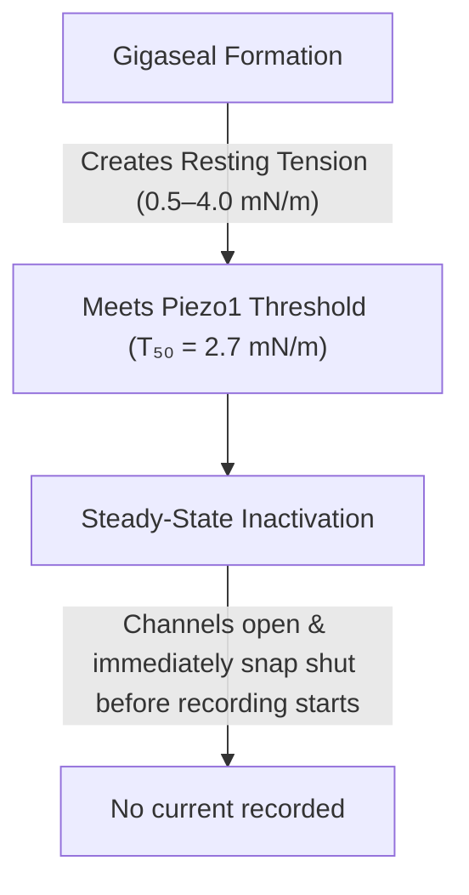

[Link to paper:](https://elifesciences.org/articles/12088)

When stimulated by mechanical forces. the cap module in Piezo1 shifts to allow positive ions to enter the cell, which triggers electrical and chemical signalling processes inside the cell.

From experiments conducted by Lewis and Grandl, it was inferred that changes in membrane tension was the only activating stimulus for Piezo1. Normal membrane tension is enough to inactivate Piezo1, hence how do Piezo1 channels differentially tune their mechanical sensitivity to their activating stimulus?

In order to activate Piezo1 in heterologous systems, two techniques are used:
- touching the membrane with a blunt glass pipette
- application of negative pressure to stretch the membrane in a patch pipette
---
### Piezo2 is activated by both convex and concave membrane curvature

>[!Question] How were the patch clamp experiments performed?
>To test this, experiments were repeated in both inside-out and outside-out patches. To isolate the membrane, scientists press a microscopic glass pipette tube against a cell and use gentle suction to isolate a tiny "patch" of the membrane. They then rip that patch completely away from the rest of the cell. This process destroys the cell's internal **cytoskeleton**.
>Once they had these isolated membrane bubbles on the tip of their glass pipettes, they used a specialized pressure machine to push and pull on them while filming with **DIC imaging**.
>- **Positive Pressure (+):** Pushing air down the pipette. This blows the membrane bubble outward, making it curve outward like a dome (**convex**).
>  - **Negative Pressure (-):** Sucking air up the pipette. This draws the membrane backward into the tube, making it curve inward like a bowl (**concave**).

Negative pressure induces a **convex curvature** of the membrane, and **rapidly-inactivating inward currents at -80 mV**. Currents increased with the magnitude of pressure. 

Positive pressure was applied to induce concave curvature in the membrane patches. Even in this protocol, Piezo1 currents were reliably induced. Peak current amplitudes also increased with the pressure here. 
Thus Piezo1 is activated both by concave and convex membrane curvature.

1. In inside-out patches, the membrane looked much thinner when isolated than when attached to the cytoskeleton. This confirmed the stripping away of the cytoskeleton, and since Piezo1 performed perfectly without it - it affirms that Piezo1 can function independently of cytoskeleton.

Interestingly, the *immediate closing mechanism of Piezo1* was compromised in outside-out configuration as compared to inside-out and cell-attached configurations. In outside-out configurations, the **rapidly-inactivating current failed, and was replaced by a sustained inward cation current**.

>[! Tldr] Result
>Piezo1 can thus respond with different sensitivities in different configurations, and its sensitivity changes with the amount of cytoskeletal content and its sidedness (convex vs. concave geometry).

---
### Piezo1 activation is consistent with membrane tension as the activating stimulus

The radius of curvature (R) of a surface exposed to a pressure difference ($\Delta P$) is directly related to lateral tension (T), as described by Laplace's law:
$$T = \frac{R \cdot \Delta P}{2} $$

While curvature is positive or negative, tension is a symmetric quantity. This strengthens the hypothesis that Piezo1 might be activated by lateral membrane tension.

They measured $R$ for each patch and pressure step.

>[!Info] Quantifying Gating via Boltzmann Distributions
> To compare how channels behave across different cells, the researchers normalized the recorded currents against their maximum plateau value ($I/I_{\max}$) and plotted them as a function of the calculated membrane tension ($T$). They fitted this data to a standard **Boltzmann function**, which models the probability of a mechanical channel transitioning from a closed to an open conformation as a function of energy input.
> From these S-shaped curves, they extracted two critical biophysical constants:
>   - $T_{50}$: The tension required to reach **half-maximal activation** (the midpoint of the curve where 50% of the channels are open).
>   - $k$: The **slope factor**, which dictates the mechanical sensitivity of the channel. A smaller $k$ means a steeper curve, indicating that a tiny additional increment in tension will rapidly snap the entire population of channels open.

It was found that **Piezo1 in the inside-out patches (separate from the cell) were much difficult to open than in the cell-attached configuration**. 

|**Metric**|**Cell-Attached Configuration (Intact Cell)**|**Inside-Out Configuration (Exfoliated Patch)**|**Statistical Significance**|
|---|---|---|---|
|**$T_{50}$**|**$2.7 \pm 0.1 \text{ mN/m}$**|**$4.7 \pm 0.3 \text{ mN/m}$**|$P < 0.001$ (Highly distinct)|
|**Slope ($k$)**|**$0.8 \pm 0.1$**|**$1.2 \pm 0.1$**|Over 30% shallower in inside-out|

Why?
In cell-attached patches, the internal cortical cytoskeleton maintains a baseline resting tension on the membrane. In the absence of such tension in isolated inside-out patches, the membrane becomes flaccid, and hence the threshold required for Piezo1 channels to become activated is much higher. This is because some amount of pressure is utilised in making the membrane taut before lateral tension can reach the Piezo1 channels.

> [!Important] Lytic Limit
>  Around lateral tension ~10 mN/m, the probability of patch rupture increases dramatically. The activating tension range of Piezo1 (~2.7-4.7 mN/m) is safely below the rupture limit of the patch.

---
### Baseline tension of a glass-membrane seal alters channel availability 

During the establishment of a tight-gigaseal on the membrane patch, the action of drawing the lipid bilayer into the glass tip creates an intrinsic tension (~ 0.5-4 mN/m) even when the pressure meter reads 0 mmHg. The activation midpoint (T50) of Piezo1 is ~2.7 mN/m, which overlaps perfectly with this resting tension.

### The Prepulse Protocol & The U-Shaped Response

To track this behaviour quantitatively, they built a waveform protocol that increments a positive conditioning prepulse for 5 seconds before dropping instantly back to zero baseline.

1. **5 Seconds of Positive Pressure:** (_The Conditioning Prepulse_)

	The pipette steps to a positive pressure (ranging from $0\text{ to }+10\text{ mmHg}$). If it hits the sweet spot ($\sim +5\text{ mmHg}$), the membrane flattens, tension goes to zero, and the silent channels recover from inactivation.

2. **Sudden Pressure Release to 0 mmHg:**The Step-Down.

	The software commands the pressure clamp to drop instantly back to $0\text{ mmHg}$.

3. **The Rebound Mechanical Shock:**The Off-Response Current.

	As pressure vanishes, the membrane violently snaps back into its native, tightly bowed resting curvature. This instantaneous spike in lateral tension shocks the newly reset, ready-to-fire Piezo1 channels, causing them to open all at once and generate a massive, rapidly-inactivating inward current _upon release_.

---

### Discussion

> [!Tldr] Take-home Points
> In mechanobiology, channels generally open using one of two models:
> - **The Tethered Model:** The channel is anchored to an external rope (like the extracellular matrix) or an internal rope (the cytoskeleton). When the cell shifts, the rope physically yanks the channel gate open. 
> - **The Bilayer (Force-from-Lipids) Model:** The channel sits independently in the oily lipid sea. When the membrane is stretched sideways, the lipids pull directly on the protein's edges to open it.
>   

> [!Check] Modulators of Piezo1's tension sensitivity
> - **The Cytoskeleton:** The internal scaffolding directly regulates local stiffness. Ripping away the cytoskeleton changes the membrane's resting properties. 
> - **Membrane Lipids (Phosphoinositides/PIP2):** Piezo1 requires specific charged lipids to function properly. When you pull an excised patch, these lipids naturally deplete over time, causing the channel's sensitivity to slide.
> - **Auxiliary Proteins (STOML3):** Co-expressing accessory proteins like STOML3 acts like a mechanical amplifier, dramatically lowering the pressure threshold needed to trigger the channel.

> [!Bug] Piezo1's function as a dynamic filter
> If mechanical force is applied very slowly, the channel passes from closed to inactivated state without producing a current.
>  The "off-response" discovered via their $+5 \text{ mmHg}$ flattening prepulse points to a beautifully elegant physiological feature. In a living tissue, cells don't just need to know when a physical force _starts_ - they often need to know exactly when it _stops_ (like a hair follicle cell registering a breeze starting versus stopping). By recovering from inactivation during moments of zero-tension or compression, Piezo1 is uniquely primed to fire a massive electrical warning shot the exact millisecond a mechanical stimulus is removed.

