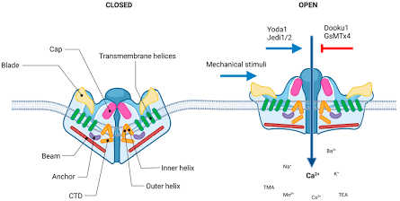

[Link to the paper](https://www.nature.com/articles/nature25743)

Piezo1 channels are of two types - 1 and 2. They are eukaryotic mechanotransducers, that are important for cytokinesis, cell migration, etc. Piezo1 senses shear stress in blood vessel development, while Piezo2 mediates touch, proprioreception, etc. Piezo1 proteins mediate mechanosensitive cation currents in lipid bilayers, and respond to poking, stretching and shear stress.

Piezo1 is an **intrinsic mechanosensor** that initiates cation currents independently of other  cellular helpers, cytoskeletal anchors, or complex enzymes to detect pressure.

 

As one can observe, Piezo1 has a three-bladed, propeller-shaped trimeric architecture. 
Simplifying it based on functional characterisations, Piezo1 might be divided into
1. the central ion-conduction pore module, and 
2. the peripheral blade-like mechanotransduction modules.

In each subunit, only 14 apparent transmembrane helices were observed, while X-ray crystallisation was used to buil a 3D structure, to an overall resolution of 3.97 angstrom. 
The structure elucidated was as follows:

### Blade modules

Piezo1 is a trimer (made of three identical protein subunits). Each subunit contributes one long "blade" that extends outward from the central ion pore.

- Each blade contains **24 transmembrane (TM) helices** - coils of amino acids that zig-zag back and forth through the oily interior of the cell membrane.
- These 24 helices are packed tightly into **12 parallel pairs**.
- When viewed from above (perpendicular to the membrane), the blade doesn't shoot straight out; it twists in a clockwise arc, forming a half-circle superhelix that resembles a curved fan or propeller blade

---
>[!info] More on the blades
>Each blade can be divided into two halves - the proximal half (closest to the central pore) and the peripheral half.  
> 
> |**View Direction**|**Measured Angle**|**What It Means Visually**| 
> |----------------------|-------------------------|------------------------------------|
> |**From Above** *(Perpendicular)*|**100° angle**|If you trace the path of the blade from the center out to the tip, it makes a sharp, horizontal curve along the plane of the membrane.|
>|**From the Side** *(Parallel)*|**140° angle**|The inner part of the blade sits flat in the normal membrane plane, but the outer part bends sharply upward at a 140° angle.|
>
>The highly curved TM blade and the intracellular helical layer might represent unique structural features not only for mechanosensing and transduction but also for inducing local membrane curvature.

---
### The Intracellular Beam

At the very centre of the channel are two extra transmembrane helices - Outer Helix (OH) and Inner Helix (IH), which form the actual walls of the pore. 

Suspended right underneath the inner leaflet of the cell membrane lies a long, rigid, continuous $\alpha$-helix roughly **90 Å in length** (intracellular beam). There are three such beams, each connecting a blade to the centre. 
It has two parts:
- **The Outer Handle (Distal End):** Connected out to the curved blades (`THU7–THU9`) near the cell membrane.
- **The Inner Working End (Proximal End):** Connected directly to the central core (`CTD` and the `Anchor`), which holds the gate shut.

>[!Note] Mechanical Pathway
>When a physical force hits the membrane, the energy moves through the beam in the following sequence:
> 1. **Tension flattens the membrane**
> When a cell is poked or stretched, the lateral mechanical tension pulls hard on the curved, outer blades of Piezo1.
> 2. **Blades flatten and move**
>    The pulling force forces the highly curved outer blades (`THU1–THU6`) to flatten out horizontally. This motion creates a massive displacement at the outer perimeter of the protein.
> 3.  **Beam lever tilts**
>    Because the **distal (outer) end** of the beam is physically anchored to these moving outer blades, this flattening motion forces the beam to tilt. As shown in the diagram, it shifts from an angled, downward slant to a flatter, more horizontal position.
> 4.  **Central pore opens**
>    Because the beam is completely rigid, it does not bend. The tilting action at the outer tip translates into a powerful physical nudge at its **proximal (inner) end**. This end pushes up against the CTD platform and twists the anchor domain, physically widening the inner helix (`IH`) walls to open the pore.

---
### 390-Residue Loop

The THU7–THU8 loop is the largest intracellular loop of Piezo1, containing approximately 390 residues. According to the structure, this loop starts at the distal end of the beam, extends 90?Å into the centre of the complex to interact with the CTD, and then folds back to the distal end of the beam before connecting to TM29. This massive loop acts like a **tether or structural sleeve**. It pins the beam securely against the underside of the machinery, ensuring that it can _only_ move along its designated pivoting arc. It guarantees that 100% of the mechanical energy harvested by the outer blades is transmitted directly to the central gate, rather than being lost to random swaying.

--- 

## Ion conducting Pathway

As evident from the blue lines, the trajectory followed by the Ca2+ ions is not a simple straight path. 
- **The Transmembrane Pore:** The central tunnel is built by three Inner Helices (IH), spanning about 29 Å across the oily membrane. At rest, this tunnel is pinched completely shut in the middle by a physical constriction point made of Valine residues (**V2476**). This represents the closed conformation.
- **The Extracellular Side Windows (Fenestrations):** The very top of the central channel is completely sealed. To get inside, positive ions (cations) must slip through side windows right above the membrane called extracellular fenestrations. Directly above these side doors sits a cluster of negatively charged amino acids. This acts as an electrostatic filter, acting like a magnet to pull in positive ions ($Ca^{2+}$, $Na^+$) while repelling negative ions ($Cl^-$).
- **The Intracellular Side Portals (Exits):** Similarly, the very bottom of the central pore is constricted. Once cations pass the central gate, they exit into the cell through three 8 Å wide side portals. These exits are heavily lined with negative charges that pull the cations out into the cytoplasm.
- **The Lipid Grooves:** The inner walls of the pore are not fully insulated from the surrounding cell membrane. There are open, greasy (hydrophobic) grooves exposing the pore directly to the membrane fats, meaning membrane lipids can directly interact with the channel walls to influence gating.

### Features of motion

By analyzing variations across their cryo-EM structural datasets, the authors discovered how the channel physically deforms when activated:

- **Asymmetric Independence:** The three propeller blades do not have to flex in perfect, symmetrical lockstep. Each individual subunit can move **independently**. Independent blades allow the channel to sense and respond to localized directional forces.
- **The Action:** When transitioning to an active state, the outer cap rotates clockwise, the outer blades twist counter-clockwise, and the inner helical layer shifts vertically. This motion actively flattens the local membrane dome, tilting the rigid beam unevenly - large displacements occur at the far outer tip (distal end), translating into high-torque movements at the inner center (proximal end) to pop open the gate.
---
